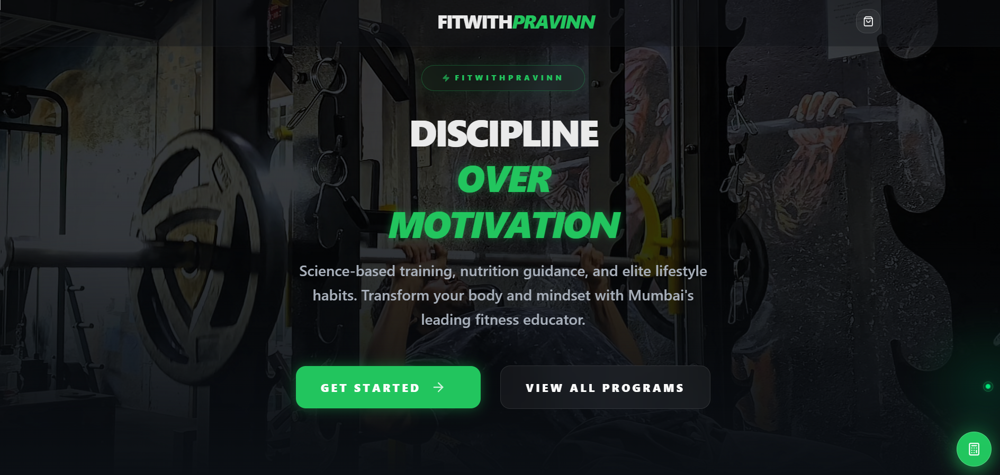

# 🏋️ FitWithPravinn — Fitness Course Platform

A full-stack fitness course platform built to sell transformation programs with limited monthly slots, secure payments, automated confirmations, and coach onboarding via WhatsApp.

This system was built for a real client and supports live users.

---

## 🚀 Live Website
👉 https://fitwithpravinn.com

## Images

<video controls src="20260217-0258-16.3634397.mp4" title="Title"></video>

---

## ✨ Features

### 🛒 Course Purchase System
- Buy fitness programs (Weight Loss, Weight Gain, etc.)
- Select course duration (1, 2, 3 months)
- Dynamic pricing based on duration
- Recommended plan highlighting

### 🎯 Limited Slot Logic
- Only **20 slots per month**
- Prevents overbooking
- Existing users can repurchase
- Admin can reset slots monthly

### 💳 Secure Payments
- Integrated with **Cashfree Payment Gateway**
- Supports UPI, Cards, Wallets
- Real-time payment verification
- Order tracking & status updates

### 📧 Automated Email Confirmation
- Sent instantly after successful payment
- Powered by **Resend**
- Includes:
  - Course details
  - Duration
  - Amount paid
  - Order ID
  - Next steps

### 📲 WhatsApp Coach Connection
After payment:
- User clicks WhatsApp button
- Pre-filled message opens
- Client continues conversation manually

### 🧑‍💼 Admin Dashboard
Admin can:
- View total orders & revenue
- Track purchases
- Monitor slot usage
- Reset monthly slots
- Manage fulfillment

---

## 🛠 Tech Stack

### Frontend
- React (Vite)
- Tailwind CSS
- Responsive UI

### Backend
- Node.js
- Express.js
- MongoDB Atlas
- REST API

### Integrations
- Cashfree Payments
- WhatsApp redirect automation

### Hosting
- Frontend: Render
- Backend: Render
- Database: MongoDB Atlas
- Domain: GoDaddy

---

## ⚙️ How It Works

1️⃣ User selects a course  
2️⃣ Chooses duration  
3️⃣ Completes payment  
4️⃣ Payment verified securely  
5️⃣ Confirmation email sent  
6️⃣ WhatsApp button appears  
7️⃣ Coach connects manually  

---

## 📦 Environment Variables

Create a `.env` file in backend:

PORT=5000
MONGODB_URI=your_mongodb_uri

CASHFREE_APP_ID=
CASHFREE_SECRET_KEY=
CASHFREE_ENV=PROD

RESEND_API_KEY=

FROM_EMAIL=FitWithPravinn no-reply@fitwithpravinn.com

WHATSAPP_PHONE_ID=
WHATSAPP_ACCESS_TOKEN=

---

## 🧪 Local Setup

### 1️⃣ Clone the repo

git clone https://github.com/akashzone/fitwithpravinn.git

cd fitwithpravinn

### 2️⃣ Install dependencies

npm install
cd client
npm install

### 3️⃣ Start development servers
Backend:
npm run dev

Frontend:
cd client
npm run dev
---

## 🔐 Security & Reliability
- Secure payment verification
- Server-side slot validation
- Environment variable protection
- Verified email domain for deliverability

---

## 📈 Future Improvements
- Automated WhatsApp bot replies
- Subscription renewal reminders
- Coupon & discount system
- User dashboard & progress tracking
- Analytics & reports

---

## 👨‍💻 Developer

**Akash Nadar**  
Full Stack Developer

Built as a production-ready system for a real fitness coaching business.

---

## 📄 License
This project is for client use. Contact developer for reuse permissions.